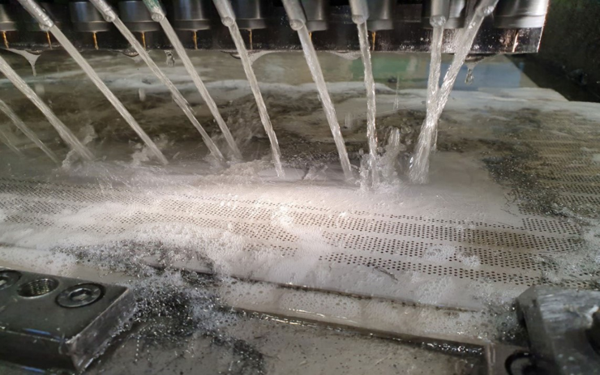
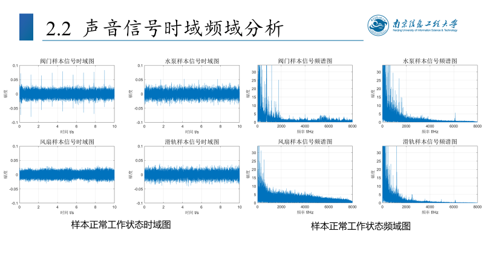

# Abnormal Sound Detection of Industrial Machines

Related work of my NUIST ungraduated thesis *Abnormal Sound Detection of Industrial Machines Based on Optimized Time-frequency Transform*.

0_Tools contains basic tools function for me to print some basic graphs, basic Mel_specgram output, data processing(from mp4 audio to 2D graph) and function for processing files.

## Abstract

**Abstract**: With the rapid development of the Industrial Internet, there is a growing demand for automatic detection of mechanical anomalies. Sound signals can reflect the running status of  equipment, however, there are some problems such as high noise and complex feature extraction. Therefore, my work presents an optimized time-frequency transform method which combines continuous wavelet transform and Mel scale to extract time-frequency spectrum, and then accurately  classify using the convolutional neural network to detect the abnormal sound of industrial machinery.

**Key words**: **Abnormal Sound Detection**; **Time Frequency Analysis**; **Continuous Wavelet Transforms**;  **Mel Scale**; **Convolutional Neural Network**

## Background

Pic1 shows the normal working state of the water pump in the real factory environment
, manual anomaly detection will have problems such as high labor costs, inability to get real-time feedback, and subjective errors.

## Data

Data from **MIMII Dataset**: Sound Dataset for Malfunctioning Industrial Machine Investigation and Inspection. Pic2 shows  time-domain and frequency-domain diagrams of valves, water pumps, fans and slide rails in normal working state.

